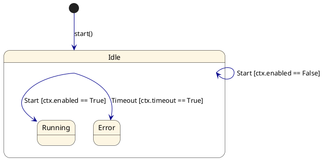

```plantuml
@startuml
skinparam state {
    BackgroundColor #FDF6E3
    BorderColor Black
    ArrowColor DarkBlue
    FontSize 14
}

[*] --> Idle : start()

state Idle {
    Idle --> Running : Start [ctx.enabled == True]
    Idle --> Idle : Start [ctx.enabled == False]
    Idle --> Error : Timeout [ctx.timeout == True]
}

state Running {
}

state Error {
}
@enduml
```